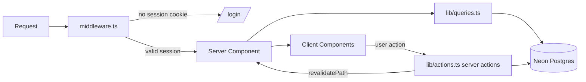

# Architecture — Lift Tracker

> Technical reference for future agents/developers. Explains how the app is structured, how
> data flows, and where to change things. Read alongside [`PRD.md`](./PRD.md) (product scope)
> and [`PROGRAM.md`](./PROGRAM.md) (the training methodology the app encodes).

## 1. What this app is

A single-user, mobile-first powerlifting tracker. It stores Training Maxes (TMs), generates
each workout's prescribed sets from the program's percentages, logs actual sets at the gym,
and auto-progresses the TM from heavy AMRAP performance. The **program logic is isolated** in
one pure-function module so the methodology can change without touching the DB or UI.

## 2. Stack

| Concern | Choice |
|---|---|
| Framework | Next.js 15 (App Router, React 19, TypeScript) |
| Styling | Tailwind CSS v3 (dark, mobile-first), Inter via `next/font`; design system in `app/globals.css` + `tailwind.config.ts` (see §9) |
| Database | Neon serverless Postgres |
| ORM / migrations | Drizzle ORM + drizzle-kit (`>= 0.31.7`, see §11) |
| Writes | Next.js Server Actions (no REST layer for app data) |
| Auth | `iron-session` signed cookie, single password |
| Charts | Recharts |
| Tests | Vitest (engine only) |

## 3. Directory map

```
app/
  layout.tsx                 root <html>; metadata + PWA manifest link
  login/                     login page + auth server actions (login/logout)
  (app)/                     authed route group (bottom-nav shell)
    layout.tsx               max-w-md container + BottomNav
    page.tsx                 Today (next queued session preview + Start)
    plan/page.tsx            Plan (upcoming sessions, pure queue simulation; see §8a)
    session/[id]/page.tsx    in-gym logging screen
    session/[id]/complete/   summary + TM-change proposals
    lifts/page.tsx           TMs (edit + history chart)
    progress/page.tsx        core-lift + accessory charts
    settings/page.tsx        bodyweight, plate increment, phase, export, logout
  api/
    export/route.ts          GET ?format=csv|json full data export
    exercises/route.ts       GET ?q= exercise catalog search

lib/
  program/                   THE ISOLATED ENGINE (no DB/React imports) — see §6
  actions.ts                 all mutating server actions ("use server")
  queries.ts                 all reads ("server-only"); Drizzle selects
  session.ts                 iron-session config + getSession()
  format.ts                  kg/date formatting + parseScheme()
components/
  ui.tsx                     PageHeader, RoleBadge, StatPill, EmptyState
  BottomNav.tsx              app tab bar
  Stepper.tsx                editable +/- field w/ validation (single-set logging)
  NumberField.tsx            compact editable validated input (dense grids)
  PlanPreview.tsx            grouped prescribed-set preview (Today + Plan)
  plan/UpcomingList.tsx      Plan-tab timeline of upcoming sessions (week-grouped, expandable)
  plan/PlanInfo.tsx          Plan-tab "How this plan works" modal (config-driven explainer)
  session/                   SetTable (inline per-lift logging grid: Set/Prev/kg/Reps/RPE/check),
                             AccessoryManager, AccessoryRow, ExercisePicker, SessionControls,
                             TmProposalCard, LastSessionSnapshot (read-only "last time"; see §7)
  lifts/TmEditor.tsx         TM edit
  settings/SettingsForm.tsx  settings form
  charts/                    LineChartCard, BarChartCard (Recharts)
  progress/                  ProgressView (core lifts), AccessoryProgress
db/
  schema.ts                  Drizzle tables (the data model, §5)
  index.ts                   lazy Neon client (Proxy; see §11)
  seed.ts                    athlete + TMs + program config
  seed-exercises.ts          loads data/exercises.json into `exercise`
  migrations/                generated SQL
data/exercises.json          bundled free-exercise-db catalog (~870, public domain)
middleware.ts                auth guard (redirects to /login)
```

## 4. Request & auth flow



- `middleware.ts` runs on every non-asset path. It reads the `iron-session` cookie; if not
  logged in and the path isn't `/login`, it redirects. Matcher excludes `_next/*`, the
  manifest, and icons.
- All read pages are Server Components marked `export const dynamic = "force-dynamic"` (they
  depend on per-request DB state + cookies).
- Mutations are **server actions** in `lib/actions.ts`. Client components call them directly
  (often inside `useTransition`); actions call `revalidatePath(...)` to refresh server data.

## 5. Data model (`db/schema.ts`)

Maps 1:1 to PRD §4. Weights are `real` kg.

- `athlete` — name, bodyweightKg, units, **plateIncrementKg** (2.5 or 1.25).
- `lift` — the 3 core lifts (`id` = `"bench" | "deadlift" | "squat"`), `trainingMaxKg`
  (nullable: squat starts TBD), `tmUpdatedAt`.
- `trainingMaxEvent` — append-only TM-change history; `reason` ∈ `amrap_beat | amrap_hit |
  amrap_miss | manual | phase0_linear`.
- `programConfig` — single row holding the **queue cursor**: `phase`, `weekIndex`,
  `dayNumber` (next day 1–4), `cycleIndex`.
- `session` — one workout instance; snapshot of `phase/weekIndex/cycleIndex/dayNumber`,
  `status` (`in_progress | completed`).
- `prescribedSet` — engine output snapshotted at generation time (role, weight, reps, flags
  `isAmrap/isBackoff/isWarmup`, targetRpe).
- `loggedSet` — actual main-lift sets (weight/reps/rpe), linked to a `prescribedSet`.
- `accessoryItem` — accessory slot in a session (name + scheme + done).
- `accessorySet` — **per-set** accessory log (weight/reps/rpe), linked to `accessoryItem`.
- `exercise` — bundled catalog (free-exercise-db) for the accessory picker search.

Weekly template days and all percentages live in **code** (`lib/program/config.ts`), not the
DB.

## 6. The progression engine (`lib/program/`) — the core of the product

Pure functions, **zero DB/React imports**. To change the methodology, change only this folder.

| File | Responsibility |
|---|---|
| `types.ts` | `LiftName`, `Role`, `Phase`, `PrescribedSet`, `AmrapResult`, `TmProposal`, etc. |
| `config.ts` | Weekly template (§5 of PROGRAM), HML percentages, wave table, rep schemes, accessories, TM deltas, warm-up ramp. **Most tuning happens here.** |
| `generateSession.ts` | `generateSession({ tms, phase, weekIndex, dayNumber, plateIncrementKg })` → ordered `PrescribedSet[]`. Skips lifts with no TM. |
| `progression.ts` | `proposeTmChange(amrapResult)` (encodes §7) and `reintroWeeklyBump(...)`. **TM is NOT plate-rounded** (see §11). |
| `queue.ts` | `advanceCursor(cursor)` (day→week→cycle, reintro→wave transition) and `isProgressionDay(...)`. |
| `preview.ts` | `previewUpcoming({ cursor, tms, plateIncrementKg, count })` → `UpcomingSession[]`. Simulates the next N sessions by repeatedly calling `generateSession` + `advanceCursor`; projects reintro weekly TM bumps (flags `tmsProjected`). Powers the Plan tab. |
| `estimate1rm.ts` | Epley/Brzycki estimators (display only, never feeds TM logic). |
| `rounding.ts` | `roundToPlate(weight, increment)` for working loads. |
| `__tests__/engine.test.ts` | 23 Vitest cases pinned to PROGRAM.md (DL 205→150 volume, −12% back-offs, wave %, progression rule, queue). Run `npm test`. |

### Program rules encoded (from PROGRAM.md)
- **Phases:** `reintro_linear` (weeks 1–3, no AMRAP, weekly linear TM bumps) → `wave`
  (4-week undulating: W1 80%/5+, W2 82.5%/4+, W3 85%/3+, W4 65% deload).
- **HML by day:** Day1 Bench heavy + DL volume; Day2 Squat + Bench volume; Day3 DL heavy +
  Bench light; Day4 DL light/variation.
- **TM auto-progression** on heavy AMRAP: beat by ≥2 → +2.5 bench / +5 squat·DL; hit → small
  bump; miss → hold. Surfaced as Accept/Edit/Decline on the session-complete screen.

## 7. Session lifecycle

1. **Start** (`startSession`): reads `programConfig` + TMs, runs `generateSession`, inserts a
   `session` row plus snapshotted `prescribedSet`s and the day's `accessoryItem`s, redirects
   to `/session/[id]`. Resumes an existing `in_progress` session instead of duplicating.
2. **Log** (`logSet`, `saveAccessorySets`): upsert/replace actual sets. Main-lift sets map to a
   prescription; accessory sets are replace-all per accessory (weight/reps/RPE per set,
   defaults seeded from the scheme via `parseScheme`). Accessories can also be added
   (`addAccessory`), swapped (`swapAccessory`), or removed (`removeAccessory`) — the picker
   (`ExercisePicker`/`AccessoryManager`) searches the bundled catalog (§10).
3. **Finish** (`completeSession`): marks completed, **advances the cursor** via
   `advanceCursor`; if a reintro week rolled over, applies `reintroWeeklyBump` to each TM
   (writes `trainingMaxEvent`s). Redirects to the complete screen.
4. **Complete screen**: recomputes `proposeTmChange` from AMRAP logs and current TMs; user
   accepts/edits/declines → `applyTmChange` updates the lift + writes an event.

**"Last time" panel** (`components/session/LastSessionSnapshot.tsx`): the session screen shows an
expandable read-only view of what was logged last time, split into two independently-sourced
parts so rep schemes always line up:
- **Main lifts** (`getPreviousSameDaySnapshot`): the most recent *completed* session with the
  **same `dayNumber` AND `phase`**. Anchoring on day + phase keeps it apples-to-apples — a
  template day always has the same main-lift roles (`lib/program/config.ts`) and phase
  distinguishes reintro from wave. Warm-ups excluded; `null` when there's no prior match.
- **Accessories** (`getAccessoryLastTimes`): per-accessory, since accessories can be swapped. For
  each accessory in the current session it finds the most recent prior logging, **preferring the
  same `dayNumber`** (consistent scheme) and only falling back to another day for swapped-in
  exercises — flagged `sameDay: false` so the UI tags the different-day context.

The panel renders whenever either part has history.

## 8. Progress analytics (`app/(app)/progress/page.tsx`)

Computed server-side, rendered with Recharts client components:
- **Core lifts** (`ProgressView`): est-1RM trend (best per day), weekly tonnage, AMRAP rep
  history.
- **Accessories** (`AccessoryProgress`): grouped by exercise name from `getAccessoryHistory`
  (joins `accessorySet → accessoryItem → session` for the date). Weighted exercises show
  est-1RM trend + tonnage; bodyweight exercises (no load) show a reps trend instead
  (`isBodyweight`). Selected via a dropdown.

## 8a. Upcoming workouts (Plan tab, `app/(app)/plan/page.tsx`)

Lets the athlete preview the next several queued sessions to plan their week. Because the
program is a **queue, not calendar-locked** (PRD §9) and the engine is pure, this is a
**read-only simulation** — no new tables, migrations, or writes, and no persisted scheduling
state.

- The page reads the current cursor (`programConfig`) + TMs + plate increment, then calls
  `previewUpcoming({ count: 8 })` (~2 weeks). The first card is the live "Next up" session and
  links back to Today (where Start lives).
- `previewUpcoming` walks `advanceCursor` forward, generating each session with
  `generateSession`. **TM projection:** reintro weekly bumps are deterministic, so it mirrors
  `completeSession` and applies `reintroWeeklyBump` on each reintro week rollover, marking
  those sessions `tmsProjected`. Wave AMRAP-driven TM changes are performance-dependent and are
  **not** predicted — the current TM is carried forward (real loads may end up higher).
- `components/plan/UpcomingList.tsx` renders a week-grouped timeline; each card shows role
  badges + a one-line summary and expands to the full breakdown via the shared `PlanPreview`.
  Flags surfaced: `AMRAP` (progression day), `Deload`, `Projected`.
- `components/plan/PlanInfo.tsx` is a "How this plan works" modal that explains the methodology
  (phases, weekly template, role percentages, wave table, warm-up ramp, TM-progression deltas).
  It is **fully derived from `lib/program/config.ts`** and recomputes sample loads with
  `roundToPlate` against the current TMs — a transparency/verification view that auto-updates if
  the program (or, later, a different plan) changes. Rendered in the page body (not the
  `backdrop-blur` header, which would trap a `fixed` overlay).

## 9. UI & design system

Mobile-first, dark, `max-w-md` centered. Tokens + reusable classes keep the look consistent.

- **Tokens** (`tailwind.config.ts`): `bg/surface/surface2/border/muted` palette, `accent`
  (amber) + `accent2` (orange), role colors `heavy/medium/light`, `shadow-card`/`shadow-glow`.
  Font is **Inter** via `next/font` (CSS var `--font-sans`).
- **Component classes** (`app/globals.css`): `card`, `btn-primary` (gradient + glow),
  `btn-secondary`, `btn-ghost`, `input`, `label`, `stepper-btn`, `chip`, `section-title`.
  There's an ambient radial accent glow on `body`.
- **Numeric input pattern** — two reusable, validated controls; both let you type directly or
  use steppers, clamp to `[min,max]` on blur, show a red border while invalid, and round to 2
  decimals:
  - `Stepper.tsx` — large +/- field for single-set logging (main lifts, TM, bodyweight).
  - `NumberField.tsx` — compact input (no buttons) for dense grids (the accessory set editor,
    which is a CSS grid `#·Weight·Reps·RPE·remove`). Save handlers also clamp as defense in
    depth, and server actions reject non-finite values.

## 10. Exercise catalog

`data/exercises.json` (free-exercise-db, public domain, ~870 exercises) is seeded into
`exercise` via `npm run db:seed-exercises`. The accessory picker (`ExercisePicker`) hits
`/api/exercises?q=` (ILIKE on name/equipment, top 30). No third-party runtime calls, no keys.
The per-day accessory list (and which single exercise fills each slot) lives in
`lib/program/config.ts` → `ACCESSORIES`.

## 11. Gotchas / conventions

- **drizzle-kit must be ≥ 0.31.7.** Neon runs Postgres 18, which exposes named NOT NULL
  constraints; older drizzle-kit emits bogus `DROP CONSTRAINT "..._not_null"` on PK columns
  and `db:push` fails with `42P16` (drizzle-orm issue #4944).
- **Stale `.next` after dep/upgrade changes:** dev can throw `Cannot find module
  './vendor-chunks/*.js'` (e.g. drizzle-orm) when webpack chunks desync (often after mixing a
  prod `next build` with `next dev`). Fix: `rm -rf .next` and restart `npm run dev`.
- **Lazy DB client** (`db/index.ts`): a Proxy defers `neon()` init until first query, so
  `next build`/tooling don't crash when `DATABASE_URL` is unset.
- **TM precision:** `proposeTmChange`/`reintroWeeklyBump` round TMs to 2 decimals, NOT to the
  plate increment — otherwise the bench +1.25 kg small bump is lost under a 2.5 kg increment.
  Plate rounding (`roundToPlate`) applies only to prescribed working loads.
- **Reads vs writes:** put reads in `lib/queries.ts` (`"server-only"`), mutations in
  `lib/actions.ts` (`"use server"`). Don't query the DB from client components.
- **Pages are `force-dynamic`.** New authed pages that read the DB should set it too.
- **Squat TM is nullable.** `generateSession` skips lifts without a TM; the UI prompts to
  calibrate on the Lifts tab.

## 12. Environment & scripts

`.env.local` (see `.env.example`): `DATABASE_URL`, `APP_PASSWORD`, `SESSION_SECRET` (≥32 chars).

```bash
npm run dev                 # dev server
npm test                    # engine unit tests
npm run db:push             # sync schema to Neon (use after schema.ts edits)
npm run db:generate         # generate SQL migration from schema
npm run db:seed             # athlete + TMs + program config
npm run db:seed-exercises   # exercise catalog
```

## 13. How to extend (common tasks)

- **Tune the program** (percentages, sets/reps, wave, deltas): edit `lib/program/config.ts`;
  update/add tests in `lib/program/__tests__`.
- **Change progression math**: edit `lib/program/progression.ts` (+ tests).
- **Add a data field**: edit `db/schema.ts` → `npm run db:push` (or `db:generate` +
  `db:migrate`) → update the relevant query/action/UI.
- **Add a screen**: create under `app/(app)/`, set `dynamic = "force-dynamic"`, read via
  `lib/queries.ts`, mutate via `lib/actions.ts`.
- **v2 backlog** lives in PRD §8 (offline sync, coach/AI review, deload auto-scheduling,
  running-load awareness, plate-math visualizer).
